# Worldwide Layoffs: Data Cleaning and Exploration using MySQL
This SQL project comprises Data Cleaning in the first part and Exploratory Data Analysis (EDA) in the second part.

## Overview
This project focuses on cleaning and analyzing a dataset of worldwide layoffs that occurred between 2020 and 2023. The dataset covers 2,361 records from 1,628 companies globally, detailing the number of layoffs, the percentage of workforce reductions, the affected industries, and more. The primary goals of the project are to clean the raw data and perform exploratory data analysis (EDA) to uncover insights into global job market trends during this period.

## About the Dataset
The dataset was scraped from Layoffs.fyi and contains the following variables:

- Company: Name of the company where layoffs occurred.
- Location: City/region where the company is located.
- Industry: The industry to which the company belongs.
- Total Laid Off: Total number of employees laid off.
- Percentage Laid Off: Percentage of the workforce that was laid off.
- Date: The date when layoffs were announced.
- Stage: The maturity stage of the company (e.g., startup, public).
- Country: The country where the layoffs occurred.
- Funds Raised (Millions): Total funds raised by the company.

The dataset originally contained 2,361 records, but after cleaning, it was reduced to 1,995 records, providing a clearer and more reliable picture for analysis.

## Data Cleaning Process
The data cleaning process was essential to ensure accuracy and consistency for the EDA. Below are the key steps involved:

1. Create a Staging Table: Worked on a temporary table to avoid altering the original dataset.
2. Remove Duplicates: Identified and eliminated duplicate rows to ensure data integrity.
3. Handle Missing Values: Dealt with null values by using appropriate imputation techniques or removing records where necessary.
4. Standardize Data: Standardized the format for all columns (e.g., dates, text) to ensure consistency.
5. Remove Unnecessary Columns: Dropped rows and columns that were not relevant for the analysis.
6. Cleaned Final Dataset: Resulted in a clean dataset of 1,995 records, suitable for analysis.

## Exploratory Data Analysis (EDA)

The cleaned dataset was analyzed to identify trends and insights related to layoffs. The following research questions guided the analysis:

### 1. How do layoff statistics vary across different companies?

- **Total layoffs by company**
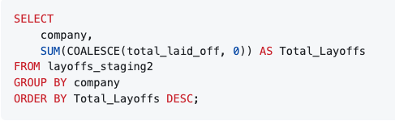
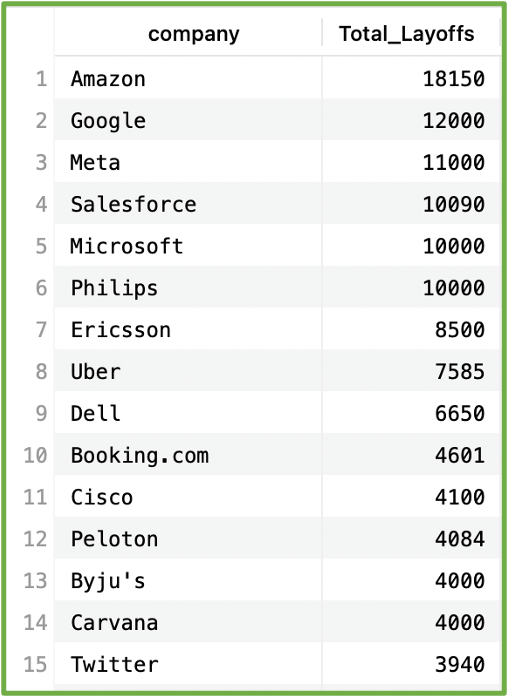

- **Companies with the highest number of layoffs in a single event**
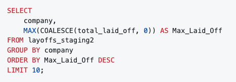
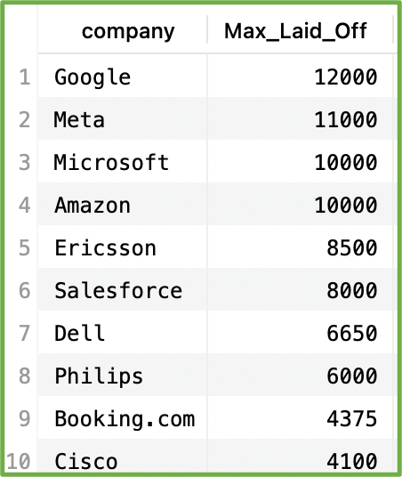

### 2. What are the yearly trends in layoffs from 2020 to 2023?

- **Number of layoffs by year**
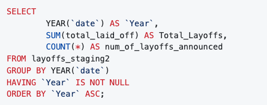
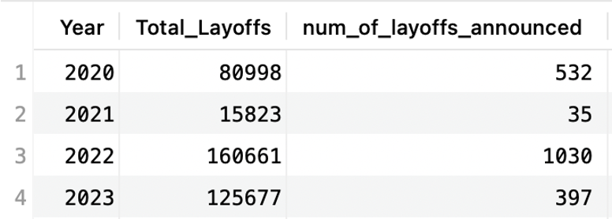

- **Ranking companies by number of layoffs for each year**
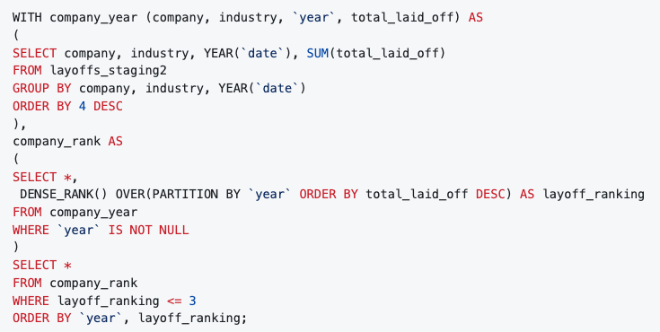
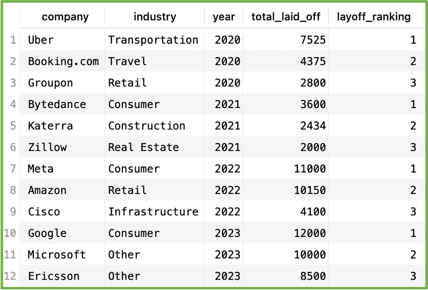

### 3. Which industries experienced the highest number of layoffs?

- **Number of layoffs per industry**
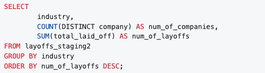
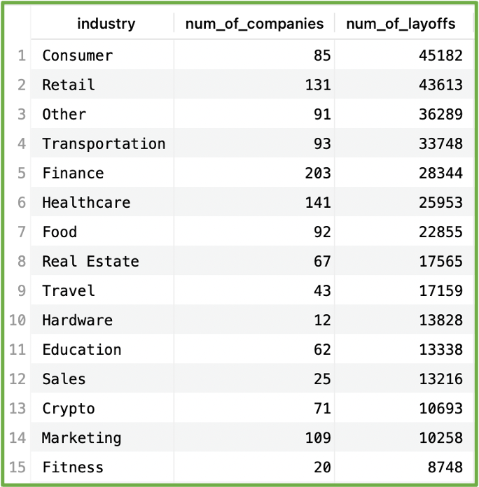

- **Top 3 industries in each year that laid off their employees**
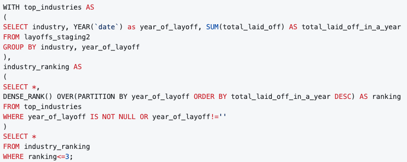
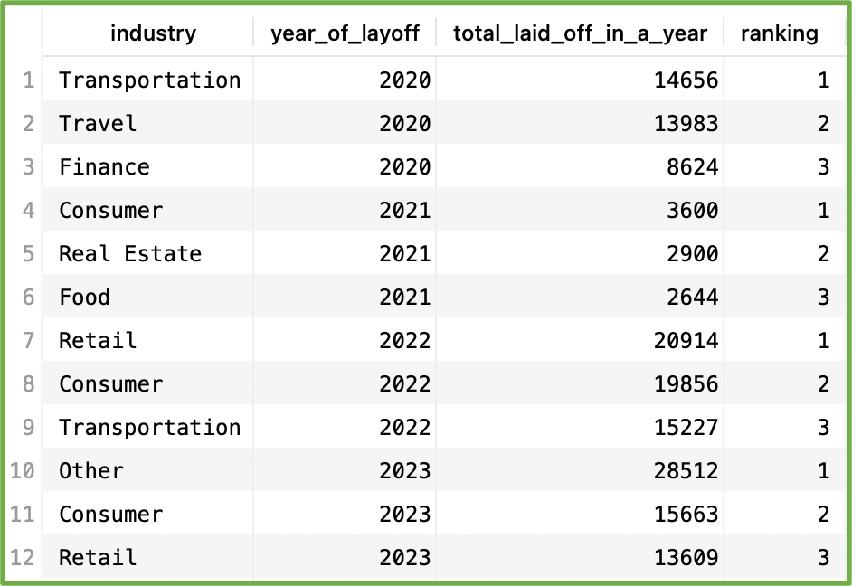

### 4. How does the geographical distribution of layoffs vary across different countries?

- **Number of layoffs by country**
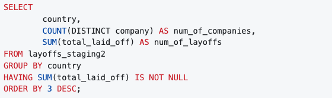
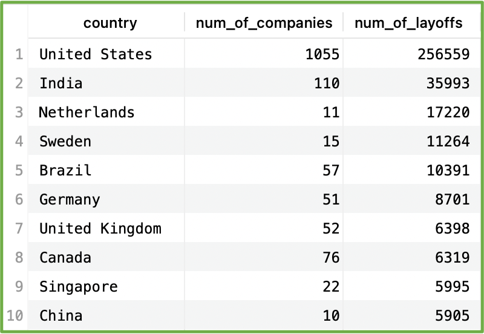

- **The percentage companies that closed down because of the layoffs, per country**
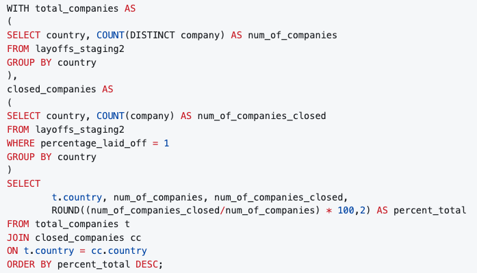
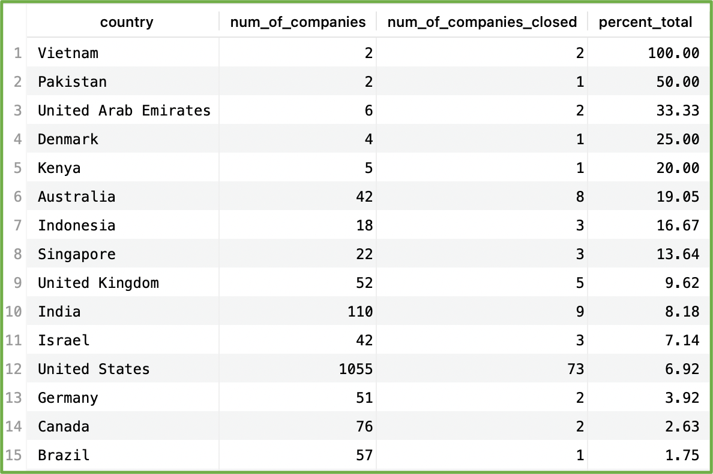

### 5. How do layoffs differ across various stages of company maturity?

- **Number of layoffs and companies per business stage**
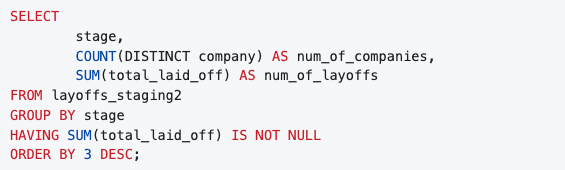
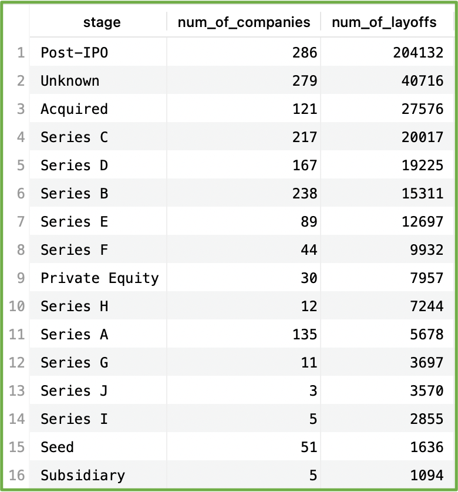

- **The percentage companies that closed down because of the layoffs, per business stage**
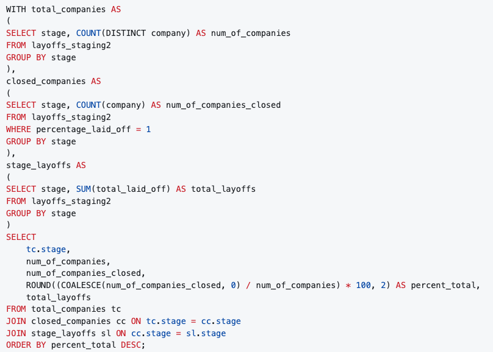
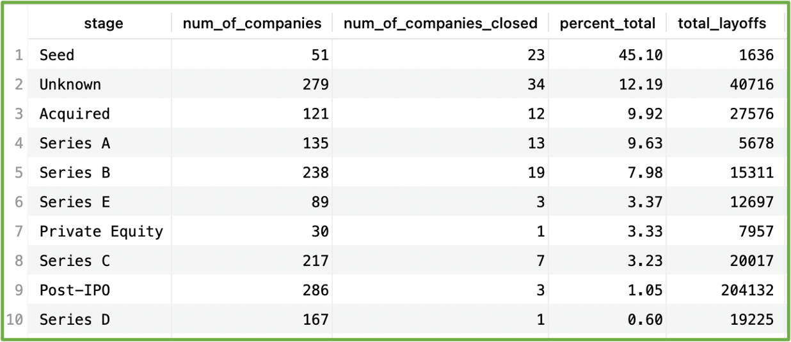

## Key Insights
**Total Layoffs:** Across all 1,640 companies analyzed in the dataset, a total of 383,159 employees were laid off between 2020 and 2023. The layoffs were not evenly distributed, with the most significant spikes occurring in 2020 (due to the onset of COVID-19) and 2022, when companies across various sectors made large-scale cuts in response to global economic challenges.

**Top Affected Industries:** The Consumer and Retail industries were the hardest hit, collectively accounting for over 88,000 layoffs. The Consumer industry led with 45,182 employees laid off, followed closely by Retail with 43,613 layoffs. These industries were particularly vulnerable due to shifts in consumer behavior, supply chain disruptions, and the broader economic downturn following the pandemic.

**Global Impact:** Layoffs spanned 51 countries, with the United States having the greatest impact by far, accounting for 256,559 layoffs—about 67% of the global total. However, when looking at the number of layoffs per company, the Netherlands had the highest average of layoffs per company, signaling that while fewer Dutch companies were affected, they experienced more significant workforce reductions. This demonstrates that even smaller countries, in terms of the number of layoffs, can be disproportionately affected when examined on a per-company basis.

**Funding Stages and Closures:** Companies in the Seed stage of funding, which typically includes startups seeking early investments, were particularly vulnerable to complete shutdowns, with 45% of these companies closing down entirely. These early-stage businesses also accounted for a relatively small number of layoffs—only 1,636 employees—because of their smaller size. In contrast, Post-IPO companies experienced the highest total layoffs at over 204,000 employees but had a much lower closure rate, with only 1% of these companies shutting down. This illustrates the resilience of larger, established firms even in times of economic hardship, while smaller startups face higher risks of failure.

**Top Companies by Layoffs:** The tech giants— Amazon, Meta, Google, Salesforce, and Microsoft were responsible for a substantial portion of the layoffs. Amazon led the pack, laying off 18,150 employees, while Meta and Google followed closely behind. This underscores the substantial workforce reductions within the technology sector, which was particularly hard-hit despite being well-funded.

**Yearly Layoff Trends:** The dataset reveals a clear trend of increasing layoffs over the three-year period. The year 2022 saw the largest number of layoffs, with over 160,000 employees losing their jobs. In 2023, while the total number of layoffs was slightly lower, the layoffs were concentrated among fewer companies, indicating larger, more significant reductions by major corporations. Across all years, 75% of the total layoffs occurred in 2022 and 2023, reflecting the broader economic challenges and the ongoing recovery from the pandemic.

## Conclusion
This analysis reveals the widespread and varied impact of global layoffs across different industries, countries, and company stages from 2020 to 2023. While the United States and Consumer industries saw the highest total layoffs, the Hardware industry and the Netherlands displayed a far greater proportional impact, with fewer companies bearing larger workforce reductions. Significant tech companies, were among the hardest hit, accounting for a large portion of layoffs. This highlights the vulnerability of even the most well-funded companies to market conditions and economic downturns.

Moreover, companies at different funding stages faced varying degrees of failure, with Seed stage startups seeing the highest closure rates, reflecting the unique challenges of early-stage businesses. In contrast, Post-IPO companies laid off the most employees but remained largely operational, signaling the adaptation strategies of larger, established firms. The data suggests that while layoffs affected many companies globally, the impact was not evenly distributed. Major corporations and early-stage startups were hit the hardest, either through large-scale layoffs or complete closures, illustrating the breadth and depth of this challenging economic period.
